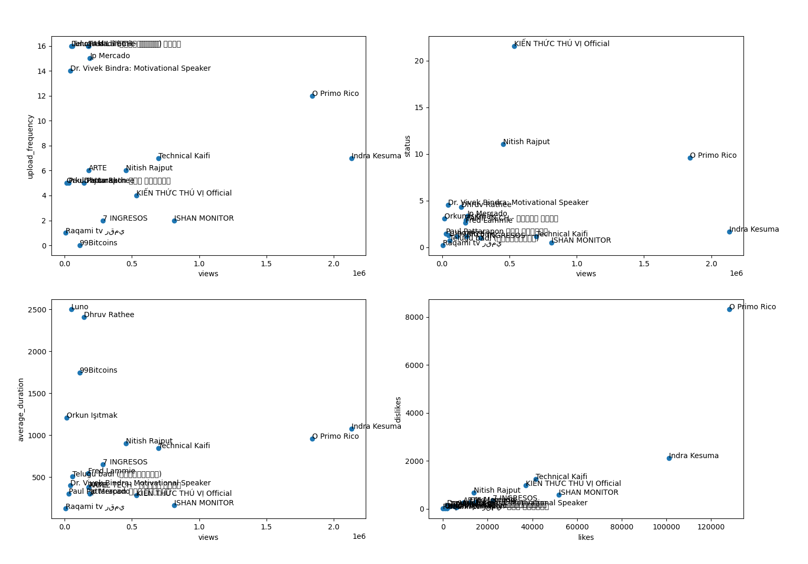
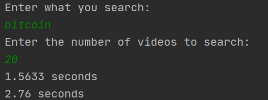

<!-- PROJECT LOGO -->
<br />
<p align="center"> 
  <h3 align="center">Youtube Data Processing </h3>
  <h5 align="center">Built in 2020 August </h5>

  <p align="center">
    Multithreading module that retrieves data from youtube and processes it locally to display most relevant YouTubers based on their likes, dislikes, views, subscribers.
  </p>
</p>


<!-- TABLE OF CONTENTS -->
<details open="open">
  <summary>Table of Contents</summary>
  <ol>
    <li>
      <a href="#about-the-project">About The Project</a>
      <ul>
        <li><a href="#built-with">Built With</a></li>
      </ul>
    </li>
    <li>
      <a href="#getting-started">Getting Started</a>
      <ul>
        <li><a href="#installation">Installation</a></li>
      </ul>
    </li>
    <li><a href="#license">License</a></li>
    <li><a href="#contact">Contact</a></li>
  </ol>
</details>


<!-- ABOUT THE PROJECT -->
## About The Project



Built as an initial idea to create social media tools for businesses to target influencers that are right for their brand. The project stopped after initial market research.

You retrieve data from youtube using google APIs and then manipulate the data to create plots for easy understanding of the information.

Contains also a Reddit data getter.

### Built With

* Python
<!-- GETTING STARTED -->

### Packages
* numpy
* pymongo
* matplotlib

## Getting Started

### Installation

1. Clone the repo
   ```sh
   git clone https://github.com/sergane13/Youtube-ApiDataGetter
   ```
2. Open project in Pycharm or any other IDE

3. Replace credentials with yours
   ```sh
    mongodb.py --> L:21 Your acces URL
    auxiliary_functions.py --> L:95 - 99 Your api/apis [I suggest to use one api]
   ```

4. Run main_yt.py

    

5. Wait a few secconds for program to run and then you will see the plot

<!-- CONTRIBUTING -->
## Project structure

```bash
< PROJECT ROOT >
   |
   |-- Reddit
      |-- main_file.py
      |-- Oauth_for_reddit.py
   |-- YT
      |-- auxiliary_functions.py
      |-- channel_class.py
      |-- data_acquisition.py
      |-- main_yt.py
      |-- mongodb.py
      |-- plot_generator.py
      |-- video_class.py
   |-- Readme                            
  ************************************************************************
```


<!-- LICENSE -->
## License

Project Template adapted from [Othneil Drew](https://github.com/othneildrew) / [Best-README-Template](https://github.com/othneildrew/Best-README-Template).


<!-- MARKDOWN LINKS & IMAGES -->
<!-- https://www.markdownguide.org/basic-syntax/#reference-style-links -->
[product-screenshot]: images/screenshot.png


## Contact
* You can find me on discord : Serban#0756
* Project is open source for any kind of use as long as you keep the initial creator